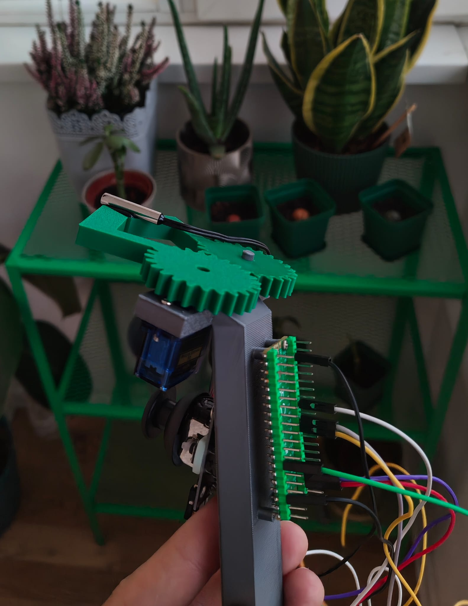
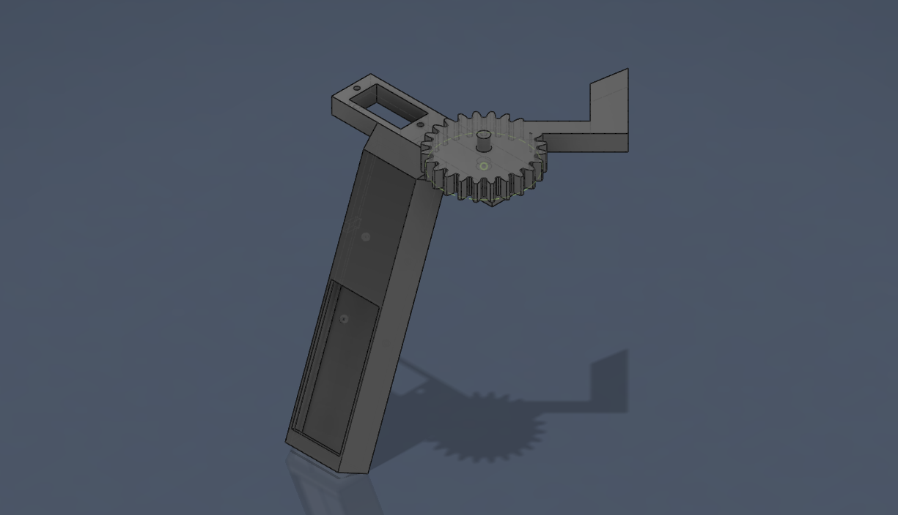

<div align="center">

<br/>

```
████████╗██╗  ██╗███████╗██████╗░███╗░░░███╗░█████╗░░█████╗░██╗░░░░░░█████╗░░██╗░░░░░░░██╗
╚══██╔══╝██║  ██║██╔════╝██╔══██╗████╗░████║██╔══██╗██╔══██╗██║░░░░░██╔══██╗░██║░░██╗░░██║
░░░██║░░░███████║█████╗░░██████╔╝██╔████╔██║██║░░██║██║░░╚═╝██║░░░░░███████║░╚██╗████╗██╔╝
░░░██║░░░██╔══██║██╔══╝░░██╔══██╗██║╚██╔╝██║██║░░██║██║░░██╗██║░░░░░██╔══██║░░████╔═████║░
░░░██║░░░██║  ██║███████╗██║░░██║██║░╚═╝░██║╚█████╔╝╚█████╔╝███████╗██║░░██║░░╚██╔╝░╚██╔╝░
░░░╚═╝░░░╚═╝  ╚═╝╚══════╝╚═╝░░╚═╝╚═╝░░░░╚═╝░╚════╝░░╚════╝░╚══════╝╚═╝░░╚═╝░░░╚═╝░░░╚═╝░░
```

# THERMO · CLAW · CONTROLLER

**Handheld 3D printed claw controller with dual servo control and real-time NTC thermistor monitoring**  

<br/>


<br/>

---

</div>

<br/>

## ⚡ Overview

ThermoClaw is a **handheld, 3D printed** servo claw controller based on an Raspberry Pi Pico. The enclosure and claw mechanism are fully 3D printed, housing a single servo driven from a single joystick axis with complementary motion logic — while simultaneously monitoring ambient temperature via a **10KΩ NTC thermistor** using the Steinhart-Hart B-parameter equation.

A future version will expose all sensor data (servo positions, live temperature) through a **browser-based web interface** for remote monitoring and control.

<div align="center">  </div>

<br/>

---

## 🖨️ 3D Printed Build

The entire chassis is **3D printed** — designed to be compact, handheld, and self-contained.

<div align="center">  </div>

| Part                  | Material    | Notes                                   |
| --------------------- | ----------- | --------------------------------------- |
| Main body / enclosure | PLA or PETG | Rigid shell housing Arduino + servos    |
| Claw fingers          | PLA or PETG | Current version                         |
| Claw fingers          | PLA or PETG | **Upcoming — improves grip on objects** |

<br/>

---

## 🔩 Hardware

| Component         | Value / Model                 | Pin  |
| ----------------- | ----------------------------- | ---- |
| Servo             | Standard PWM Servo            | `22` |
| Joystick (X-axis) | Analog joystick               | `A1` |
| Mode Switch       | Momentary button (active LOW) | `5` |
| NTC Thermistor    | 10KΩ @ 25°C, B=3977K          | `A0` |
| Fixed Resistor    | 10KΩ (voltage divider)        | —    |

<br/>

---

## 🌡️ Thermistor Wiring

The thermistor uses a **voltage divider** configuration for optimal sensitivity in the room-temperature range:

<div align="center">  </div>

```
        5V
         │
    ┌────┴────┐
    │ NTC 10K │   ← Thermistor (not polarized)
    └────┬────┘
         │
         ├──────── A2  (analogRead)
         │
    ┌────┴────┐
    │  R 10K  │   ← Fixed resistor
    └────┬────┘
         │
        GND
```
<br/>

---

## 🎮 Control Logic

### Normal Mode

The joystick X-axis (`A1`) maps `0–1023` → `0°–180°` to control de servo.  

### Button Mode (`5` held LOW)

The servo locks to **170°** .

<br/>

---

## 🧮 Temperature Formula

Uses the **Steinhart-Hart simplified B-parameter equation**:

```
         1
T = ─────────────────────
    ln(RT/RT₀)     1
    ──────────  +  ──
        B          T₀
```

Where:

- `RT` = measured thermistor resistance
- `RT₀` = 10,000 Ω (resistance at 25°C)
- `B` = 3977 K (thermistor B-constant)
- `T₀` = 298.15 K (25°C reference)

**Voltage divider resistance calculation (thermistor on top):**

```cpp
VRT = (5.0 / 1023.0) * analogRead(A2);   // ADC → voltage
VR  = VCC - VRT;                           // voltage across fixed R
RT  = (VR / VRT) * R;                     // thermistor resistance
```

<br/>

---

<br/>

</div>
